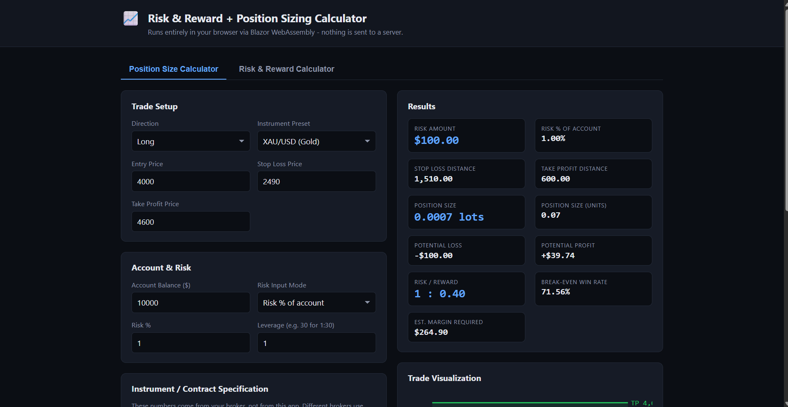
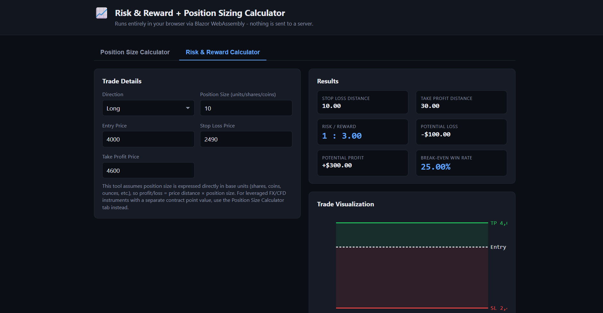

# Risk & Reward + Position Sizing Calculator

A Risk & Reward and Position Sizing calculator for traders, built as a learning
project for **C#, .NET, Blazor, and WebAssembly**. It runs entirely in the
browser — there is no server, no API, and no database.

> ⚠️ **Not financial advice.** This is an educational calculator only. It does not
> account for spreads, commissions, swaps, slippage, taxes, or broker-specific
> margin rules. Always verify contract specifications with your own broker and
> never risk money you cannot afford to lose.

---

## 1. Project Overview

The app has two tools, both driven by the same trade prices:

- **Position Size Calculator** — tells you *how many lots/units* to trade so
  that hitting your stop loss loses exactly the amount of money you decided to
  risk (either as a % of account balance or a fixed dollar amount).
- **Risk & Reward Calculator** — given a position size you already have in
  mind, tells you the risk/reward ratio, potential profit/loss, and the
  break-even win rate for the trade.

Both tools share entry/stop-loss/take-profit inputs, a live SVG trade
visualization, and a "Trade Summary" you can copy to your clipboard.

## 2. Features

- Position sizing from **Risk %** or a **fixed risk amount** — switch freely,
  the app keeps both values consistent.
- Fully **configurable instrument/contract parameters** (contract size,
  point/pip size, point/pip value) — nothing about "how much a point is worth"
  is hard-coded, because that genuinely differs between brokers.
- Instrument **presets** (XAU/USD, EUR/USD, GBP/USD, USD/JPY, BTC/USD, Custom)
  as editable starting points, not fixed truths.
- **Long/Short** support with direction-aware validation (stop loss and take
  profit must sit on the correct side of entry).
- Risk/Reward ratio, **break-even win rate** (`Risk / (Risk + Reward)`),
  potential profit and loss.
- A responsive **SVG trade visualization** that lays out entry/SL/TP purely
  from the price values, so it works for Long and Short without special-casing.
- **Trade Summary** with a one-click **Copy to Clipboard** button.
- **Local storage** remembers your last account balance, risk settings,
  instrument, and trade inputs between visits.
- Dark, responsive, trading-dashboard-style UI. Desktop and mobile friendly.
- A calculation engine (`Services/`) that is fully unit tested and has **zero
  dependency on Blazor** — the same math could be reused in a console app, an
  API, or a future backend.

## 3. Screenshots

<p align="center">
  
  
</p>

## 4. Technology Stack

| Layer            | Technology                                  |
|-------------------|----------------------------------------------|
| UI framework       | Blazor WebAssembly (Razor Components)        |
| Language           | C# (.NET 10, nullable reference types)       |
| Styling            | Plain CSS (dark theme, CSS Grid/Flexbox)     |
| Interactivity      | Blazor event bindings (`@onclick`, `@oninput`) |
| Browser-only APIs  | One tiny JS interop file (`wwwroot/js/interop.js`) for Clipboard + `localStorage` |
| Testing            | xUnit                                        |
| Hosting            | Static files on Vercel (or any static host)  |

No JavaScript framework, no backend, no database, no external API calls.

## 5. Architecture

```text
RiskRewardCalculator/
├── RiskRewardCalculator.sln
├── src/
│   └── RiskRewardCalculator/            # The Blazor WebAssembly app
│       ├── RiskRewardCalculator.csproj
│       ├── Program.cs                   # WASM entry point + DI setup
│       ├── App.razor                    # Router
│       ├── Models/                      # Plain C# data models (no UI code)
│       │   ├── TradeDirection.cs
│       │   ├── RiskMode.cs
│       │   ├── CalculatorTool.cs
│       │   ├── InstrumentSettings.cs
│       │   ├── RiskSettings.cs
│       │   ├── TradeInput.cs
│       │   ├── PositionSizeResult.cs
│       │   ├── RiskRewardResult.cs
│       │   └── PersistedState.cs
│       ├── Services/                    # All calculation + interop logic
│       │   ├── IPositionSizeCalculator.cs
│       │   ├── PositionSizeCalculator.cs
│       │   ├── IRiskRewardCalculator.cs
│       │   ├── RiskRewardCalculator.cs
│       │   ├── InstrumentPresetProvider.cs
│       │   └── LocalStorageService.cs   # Wraps the one JS interop file
│       ├── Components/                  # Reusable Razor UI pieces
│       │   ├── PositionSizeForm.razor
│       │   ├── RiskRewardForm.razor
│       │   ├── ResultsCard.razor
│       │   ├── ResultRow.cs
│       │   ├── TradeVisualization.razor
│       │   └── TradeSummary.razor
│       ├── Pages/
│       │   └── Home.razor               # Composes everything above
│       ├── Layout/
│       │   └── MainLayout.razor
│       └── wwwroot/
│           ├── index.html
│           ├── css/app.css
│           └── js/interop.js            # The ONLY JavaScript in the project
└── tests/
    └── RiskRewardCalculator.Tests/      # xUnit tests for Services/*
```

**Separation of concerns:**
- `Models/` — plain data, no logic beyond simple derived properties
  (e.g. `TradeInput.StopLossDistance`).
- `Services/` — all the math and all the validation. Nothing in here knows
  about Blazor, HTML, or rendering — it's testable like any C# library.
- `Components/` + `Pages/` — UI only. They call into `Services/` and render
  the results; they never duplicate a formula.

## 6. Calculation Formulas

### Position sizing
```
StopLossDistance   = |Entry - StopLoss|
TakeProfitDistance = |TakeProfit - Entry|

RiskAmount  = AccountBalance * (RiskPercent / 100)      [Risk % mode]
            = RiskAmount                                 [Fixed amount mode]

MoneyPerPriceUnitPerLot = PointValuePerLot / PointSize
MoneyPerLotAtStop       = StopLossDistance * MoneyPerPriceUnitPerLot

PositionSizeInLots  = RiskAmount / MoneyPerLotAtStop
PositionSizeInUnits = PositionSizeInLots * ContractSize

PotentialLoss   = MoneyPerLotAtStop * PositionSizeInLots        (≈ RiskAmount)
PotentialProfit = TakeProfitDistance * MoneyPerPriceUnitPerLot * PositionSizeInLots
```

### Risk & Reward
```
RiskRewardRatio    = TakeProfitDistance / StopLossDistance
PotentialLoss      = StopLossDistance * PositionSizeInUnits
PotentialProfit    = TakeProfitDistance * PositionSizeInUnits
BreakEvenWinRate%  = Risk / (Risk + Reward) * 100
```

### Validation rules
- Long: `StopLoss < Entry < TakeProfit`
- Short: `StopLoss > Entry > TakeProfit`
- Account balance, entry, stop loss, take profit, position size, contract
  size, and point value must all be `> 0`.
- Risk % must be `> 0` and `<= 100`.

### On precision and rounding
Every intermediate value (`StopLossDistance`, `RiskAmount`,
`PositionSizeInLots`, etc.) is calculated using C#'s `decimal` type, which is
exact for base-10 fractional values (unlike `double`), and **no rounding is
applied until display time**. Only the Razor markup rounds values — via format
strings like `"N2"` for money or `"N" + PriceDecimals` for prices — so that
what you see is a display choice, not a source of compounding error. If you
chain the calculator's own output back in as a new input (e.g. copy the
position size elsewhere), you're working from the full-precision number, not a
rounded one.

## 7. How Blazor WebAssembly Actually Works Here

1. **What gets compiled**: All the C# in `Models/`, `Services/`,
   `Components/`, and `Pages/` compiles to a normal .NET assembly (a `.dll`),
   exactly like any other C# project — there is nothing WASM-specific about
   the C# code itself.
2. **What runs in the browser**: When you open the page, the browser downloads
   the .NET WebAssembly runtime (`dotnet.wasm`) plus your app's `.dll` files
   and the BCL assemblies it needs. The browser's WebAssembly engine then
   executes that runtime, which in turn interprets/JITs your compiled .NET IL
   — the same IL that would run on a server. Your C# code, the calculators,
   and the Razor component rendering logic all execute as WebAssembly
   instructions inside the tab.
3. **Why no backend is required**: Because the .NET runtime itself is running
   client-side, there's no need for a server to execute your C# — the browser
   is the runtime host. The "server" here is only a static file host
   delivering unchanging files (HTML/CSS/JS/WASM/DLLs); it does no computation.
4. **What the browser downloads**: `index.html`, `app.css`, `interop.js`, the
   Blazor bootstrapper (`blazor.webassembly.js`), the .NET WASM runtime
   (`dotnet.wasm` and friends), and your compiled app + framework `.dll`
   files, all listed in `_framework/blazor.boot.json`. The browser caches
   these aggressively after the first load.
5. **Blazor WebAssembly vs. "normal" ASP.NET Core / Blazor Server**: In
   ASP.NET Core (including Blazor Server), your C# runs **on the server**;
   the browser just renders HTML/CSS and, for Blazor Server, keeps a live
   SignalR connection to relay UI events back to the server for every
   interaction. In Blazor **WebAssembly**, your C# runs **on the client**; once
   the files are downloaded, the app works fully offline and needs no
   persistent connection to anything. That's also why this project can be
   hosted as plain static files on Vercel instead of a real ASP.NET Core
   server.

## 8. Local Storage — Why and How

The app remembers your last account balance, risk mode, instrument settings,
and trade prices using the browser's `localStorage`. No external package is
needed: `localStorage` is a native browser API, and Blazor's built-in
`IJSRuntime` is all that's required to call it. See "JavaScript Interop"
below for exactly how that call is made.

## 9. JavaScript Interop — Why It Exists

.NET compiled to WebAssembly cannot call `navigator.clipboard` or
`window.localStorage` directly — those only exist as JavaScript objects in the
browser; WebAssembly's sandbox has no built-in binding to them. Blazor bridges
this gap with `IJSRuntime`, which lets C# call named JavaScript functions.

This project keeps that bridge to a **single file**,
`wwwroot/js/interop.js`, exposing exactly four functions
(`copyToClipboard`, `localStorageGet/Set/Remove`), wrapped by
`Services/LocalStorageService.cs`. Every other line of interactive logic in
the app — all validation, all math, all UI state — is C#.

## 10. Installation

**Prerequisites:** [.NET SDK](https://dotnet.microsoft.com/download) — .NET 10
(or edit the two `.csproj` files to target `net8.0` if that's what you have
installed; the code itself doesn't use any .NET 10-only APIs).

```bash
git clone <your-repo-url>
cd RiskRewardCalculator
dotnet restore
```

## 11. Development

Run the app with hot reload:

```bash
cd src/RiskRewardCalculator
dotnet watch run
```

This starts a local dev server (typically `https://localhost:5001` or similar
— check the console output) that recompiles and refreshes the browser as you
edit `.razor`/`.cs` files.

Run the tests:

```bash
cd tests/RiskRewardCalculator.Tests
dotnet test
```

## 12. Production Build

```bash
dotnet publish src/RiskRewardCalculator/RiskRewardCalculator.csproj -c Release -o publish-output
```

The static site to deploy is at:

```
publish-output/wwwroot
```

You can sanity-check the production build locally with any static file
server, for example:

```bash
cd publish-output/wwwroot
python3 -m http.server 8080
# open http://localhost:8080
```

(A plain static server is enough — there's no backend to run alongside it.)

## 13. Vercel Deployment

`vercel.json` is already set up to build and serve the app as static files:

```json
{
  "buildCommand": "curl -sSL https://dot.net/v1/dotnet-install.sh -o dotnet-install.sh && chmod +x dotnet-install.sh && ./dotnet-install.sh -c 10.0 --install-dir ./dotnet-sdk && ./dotnet-sdk/dotnet publish src/RiskRewardCalculator/RiskRewardCalculator.csproj -c Release -o publish-output",
  "outputDirectory": "publish-output/wwwroot",
  "rewrites": [{ "source": "/(.*)", "destination": "/index.html" }]
}
```

**Why `buildCommand` looks unusual:** Vercel's default Linux build image does
**not** include the .NET SDK (it's tuned for Node.js/JS frameworks). So the
build command first downloads Microsoft's official
[`dotnet-install.sh`](https://learn.microsoft.com/dotnet/core/tools/dotnet-install-script)
script and uses it to install .NET 10 into a local `./dotnet-sdk` folder
*inside the build container* — nothing is installed on your machine — and
only then runs `dotnet publish` using that freshly-installed SDK. This is the
same approach Cloudflare Pages documents for deploying Blazor. If your build
logs show a different .NET SDK is needed, change the `-c 10.0` flag to match
(e.g. `-c 8.0`) and update the `TargetFramework` in both `.csproj` files to
match.

- **`outputDirectory`** points Vercel at the static `wwwroot` output that
  `dotnet publish` produces.
- **`rewrites`** provide the SPA fallback: any path that isn't a real file
  (like `/some-client-route`) falls back to `index.html` so Blazor's router
  can take over. Real static assets (the `_framework/*` files, CSS, JS) are
  still served directly, since Vercel checks the filesystem before applying
  rewrites.

### Deploying via GitHub

1. Push this repository to GitHub.
2. In the [Vercel dashboard](https://vercel.com/new), click **Add New →
   Project** and import the GitHub repo.
3. Vercel will detect `vercel.json` and use its `buildCommand` /
   `outputDirectory` automatically — leave the framework preset as "Other".
4. Click **Deploy**. The first build will take a bit longer than usual since
   it's downloading the .NET SDK; subsequent pushes to your default branch
   redeploy automatically and Vercel will cache what it can.

### Alternative: build locally, deploy only the static output

If you'd rather not have Vercel install .NET on every build (e.g. to keep
builds fast, or if your Vercel plan restricts build time), you can build
locally and deploy just the compiled static site instead:

```bash
dotnet publish src/RiskRewardCalculator/RiskRewardCalculator.csproj -c Release -o publish-output
cd publish-output/wwwroot
vercel --prod   # requires `npm i -g vercel` and `vercel login` once
```

This skips `vercel.json`'s `buildCommand` entirely — you're just handing
Vercel a folder of static files to serve, no .NET required on their side. The
trade-off is that GitHub pushes won't auto-redeploy; you'd re-run this
manually (or wire it into your own GitHub Action) whenever you want to publish
a new version.

```text
GitHub
   ↓
Vercel (runs `dotnet publish`)
   ↓
Static files in publish-output/wwwroot
   ↓
Browser downloads them
   ↓
C# runs through WebAssembly, entirely client-side
```

## 14. Limitations

- No spreads, commissions, swaps, or slippage are modeled.
- Margin estimates are approximate and ignore broker-specific tiered margin,
  currency conversion, and hedging rules.
- Instrument presets are illustrative examples, not verified broker data.
- The Risk & Reward calculator treats position size as raw units (shares,
  coins, etc.) rather than being contract-spec aware like the Position Size
  calculator — see the in-app hint on that tab.
- No persistence beyond a single browser's `localStorage` (nothing is synced
  across devices, since there is intentionally no backend in v1).

## 15. Future Improvements

- Optional backend for saving trade history across devices.
- Multi-leg / partial take-profit position sizing.
- Configurable decimal precision exposed per-field in the UI (currently
  price decimals are configurable; money/percent formatting is fixed).
- Support for entering stop loss / take profit in "points/pips" directly,
  in addition to absolute prices.
- Localization (multi-currency, multi-language).
- Automated screenshot generation for this README.

---

*Built as a learning exercise in C#, .NET, Blazor, and WebAssembly. Not
financial advice — always do your own research and risk management.*
